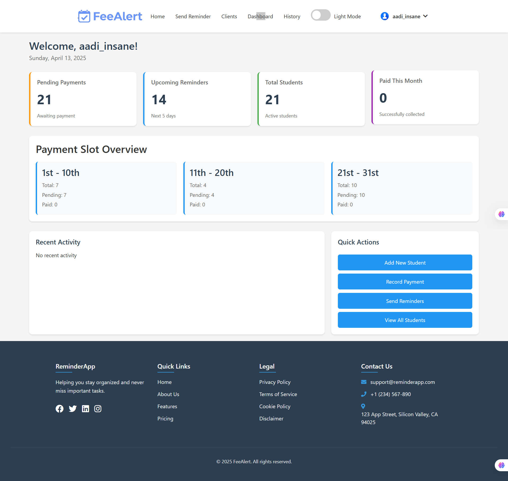
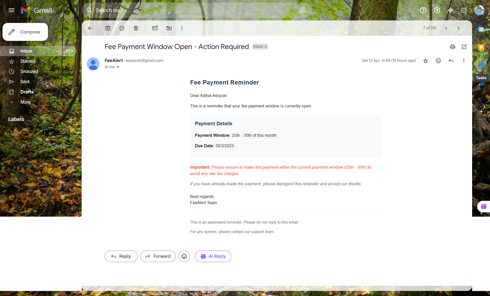
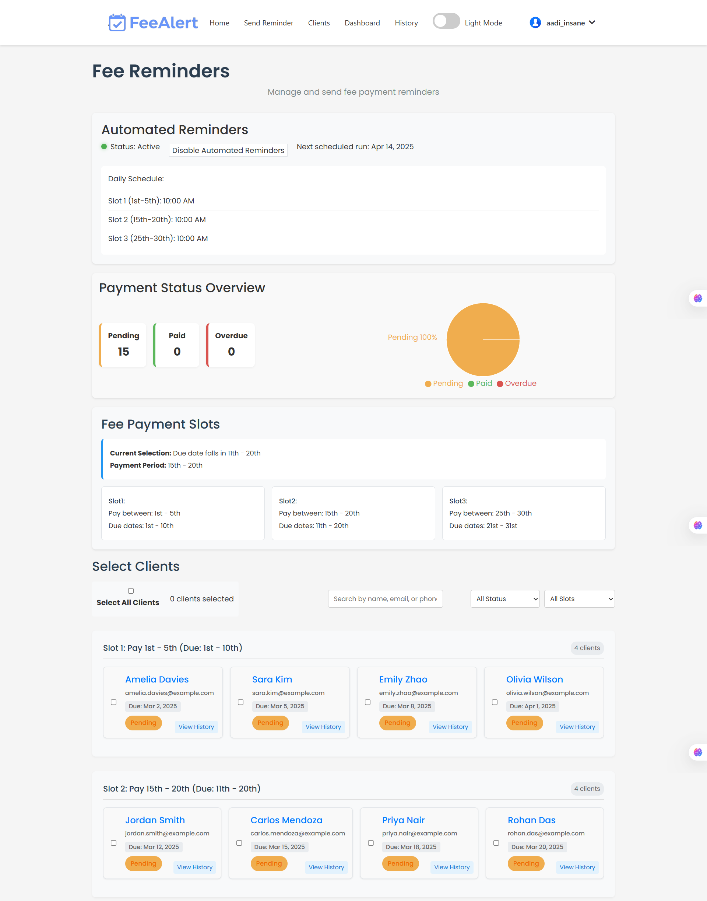
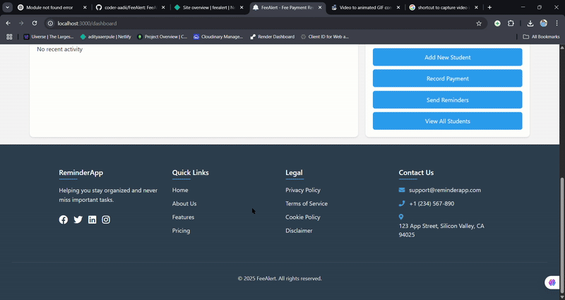

# FeeAlert - Smart Fee Management System 🚀

[](https://choosealicense.com/licenses/mit/)
[](https://feealert.netlify.app)
[](https://github.com/coder-aadii/feealert)

<div align="center">
  
  
  ### 💰 Never Miss a Payment – Automated Fee Reminders Made Simple
  
  [Live Demo](https://feealert.netlify.app) | [Documentation](https://feealert.netlify.app) | [Report Bug](https://github.com/coder-aadii/feealert/issues) | [Request Feature](https://github.com/coder-aadii/feealert/issues)
</div>

## ✨ Why FeeAlert?

Managing fee collections shouldn't be a headache! FeeAlert transforms the way yoga instructors, tutors, and small business owners handle payment reminders. With automated SMS and email notifications, your clients stay informed while you focus on what matters most – your business.

<div align="center">
  
</div>

## 🎯 Key Features

<div align="center">
  <table>
    <tr>
      <td align="center">
        <br>
        <strong>Dual Notifications</strong><br>
        SMS & Email Reminders
      </td>
      <td align="center">
        <br>
        <strong>Smart Dashboard</strong><br>
        Real-time Analytics
      </td>
      <td align="center">
        <br>
        <strong>Flexible Scheduling</strong><br>
        Custom Reminder Times
      </td>
    </tr>
  </table>
</div>

- 📱 **Automated Reminders** - Schedule SMS and email reminders that deliver on time, every time
- 📊 **Intuitive Dashboard** - Track payments and manage clients with our user-friendly interface
- 🎯 **Zero Client Setup** - No apps to install, no accounts to create for your clients
- ⚡ **Quick Setup** - Get started in minutes with our guided setup process
- 🔒 **Secure & Private** - Your data is encrypted and protected

## 🎬 See It In Action

<div align="center">
  
</div>

## 🚀 Quick Start

```bash
# Clone the repository
git clone https://github.com/coder-aadii/feealert.git

# Install dependencies
cd feealert
npm install

# Start the application
npm start
```

## 💻 Tech Stack

<div align="center">
  <table>
    <tr>
      <td align="center">
        <br>
        React.js
      </td>
      <td align="center">
        <br>
        Node.js
      </td>
      <td align="center">
        <br>
        MongoDB
      </td>
      <td align="center">
        <br>
        Material-UI
      </td>
    </tr>
  </table>
</div>

## 📸 Screenshots

<div align="center">
  <table>
    <tr>
      <td></td>
      <td></td>
    </tr>
    <tr>
      <td></td>
      <td></td>
    </tr>
  </table>
</div>

## 🌟 User Testimonials

> "FeeAlert has transformed how I manage my yoga studio's fee collection. It's a game-changer!" - Sarah P., Yoga Instructor

> "The automated reminders have reduced late payments by 75%. Simply amazing!" - John D., Music Teacher

## 📊 Performance Metrics

- 🎯 98% Reminder Delivery Rate
- ⚡ 65% Reduction in Late Payments
- 📈 40% Time Saved on Payment Follow-ups

## 🛠️ Installation

### Prerequisites

- Node.js (v14 or higher)
- MongoDB (optional)
- Gmail account (for email notifications)
- SIM card or Twilio account (for SMS notifications)

### Setup Steps

1. Clone the repository:
   ```bash
   git clone https://github.com/coder-aadii/feealert.git
   cd feealert
   ```

2. Install backend dependencies:
   ```bash
   cd backend
   npm install
   ```

3. Install frontend dependencies:
   ```bash
   cd ../frontend
   npm install
   ```

4. Create a `.env` file in the backend directory with the following variables:
   ```
   PORT=5000
   MONGO_URI=your_mongodb_uri_or_connection_string
   EMAIL_SERVICE=gmail
   EMAIL_USER=your_email@gmail.com
   EMAIL_PASS=your_app_specific_password
   SMS_PROVIDER=twilio_or_gammu
   TWILIO_ACCOUNT_SID=your_twilio_sid
   TWILIO_AUTH_TOKEN=your_twilio_auth_token
   TWILIO_PHONE_NUMBER=your_twilio_phone_number
   BACKEND_URL=http://localhost:5000
   ```

5. Create a `.env` file in the frontend directory with the following variable:
   ```
   REACT_APP_BACKEND_URL=http://localhost:5000
   ```
   Note: For Create React App, environment variables must be prefixed with REACT_APP_ to be accessible in your code.

6. Set up Gmail App Password for Nodemailer (email reminders).

7. Set up your preferred SMS service (Twilio or Gammu).

### Running the Application

1. Start the backend server:
   ```bash
   cd backend
   npm start
   # Or for development with auto-restart:
   npm run dev
   ```

2. Start the frontend development server:
   ```bash
   cd frontend
   npm start
   ```

The application will be available at `http://localhost:3000`

## 📁 Project Structure

```
feealert/
├── backend/
│   ├── config/         # Configuration files
│   ├── controllers/    # Request handlers
│   ├── models/         # Database models
│   ├── routes/         # API routes
│   ├── services/       # Business logic
│   ├── utils/          # Helper functions
│   └── server.js       # Entry point
├── frontend/
│   ├── public/         # Static files
│   ├── src/
│   │   ├── components/ # React components
│   │   ├── pages/      # Page components
│   │   ├── services/   # API services (using REACT_APP_BACKEND_URL)
│   │   ├── utils/      # Helper functions
│   │   └── App.js      # Main component
│   └── package.json
└── README.md
```

## 🤝 Contributing

We welcome contributions! Please follow these steps:

1. Fork the repository
2. Create your feature branch (`git checkout -b feature/AmazingFeature`)
3. Commit your changes (`git commit -m 'Add some AmazingFeature'`)
4. Push to the branch (`git push origin feature/AmazingFeature`)
5. Open a Pull Request

<div align="center">
  
</div>

## 📝 License

This project is licensed under the MIT License - see the [LICENSE](LICENSE) file for details.

## 🌟 Show Your Support

Give a ⭐️ if this project helped you!

<div align="center">
  <a href="https://www.buymeacoffee.com/coder-aadii">
    
  </a>
</div>

## 📞 Contact

Have questions? Reach out to us:

- Email: support@feealert.com
<!-- - Twitter: [@FeeAlert](https://twitter.com/FeeAlert) -->
- Website: [www.feealert.com](https://feealert.netlify.app)

<div align="center">
  Made with ❤️ by the FeeAlert Team
</div>
```

Let me know if you need further details or adjustments for any part of the project!
